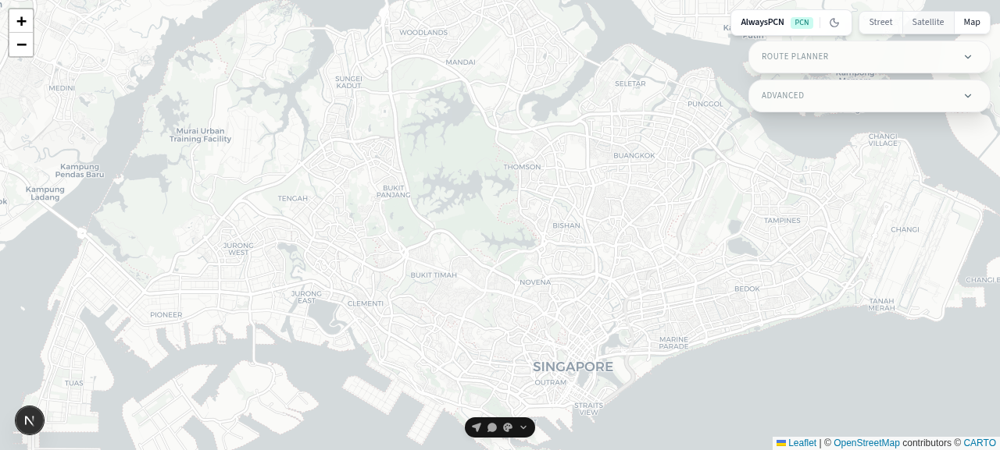
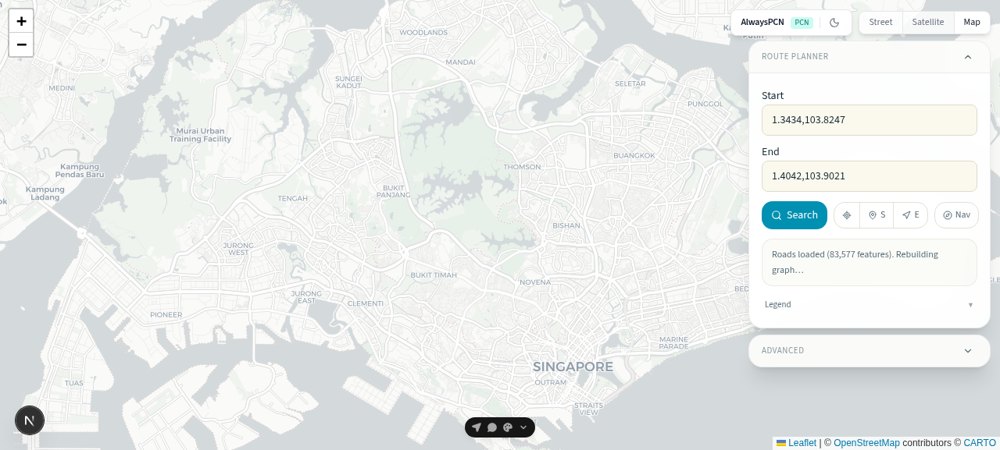
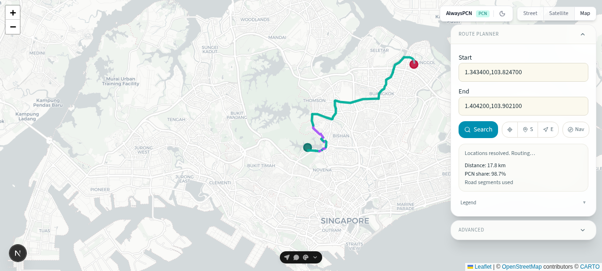
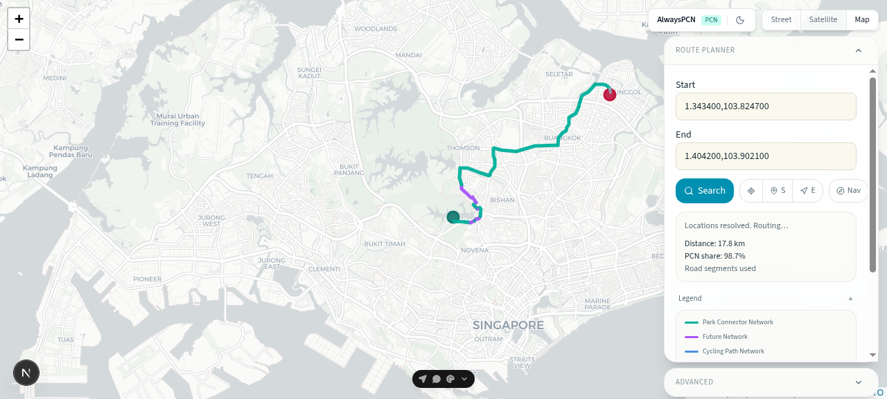
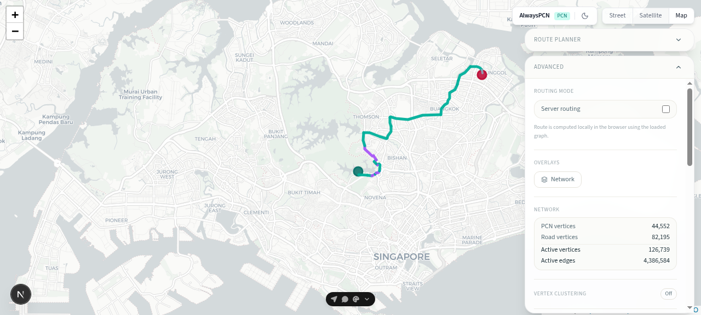
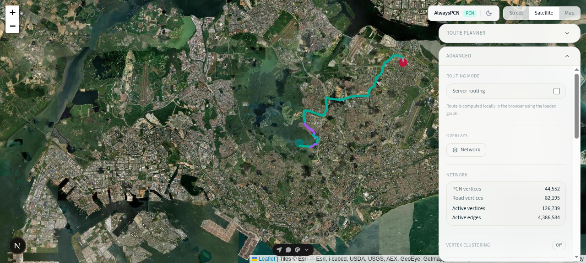
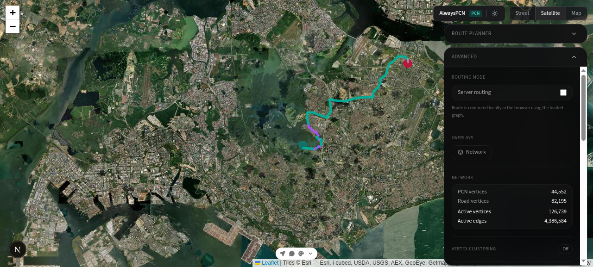

# AlwaysPCN

**Park-Connector-First Route Planning for Singapore**

---

## Overview

AlwaysPCN is a specialized route planning application designed for cyclists, runners, and outdoor enthusiasts in Singapore. Unlike generic navigation apps that prioritize the fastest route via arterial roads, AlwaysPCN maximizes time spent on Singapore's Park Connector Network (PCN) — scenic, low-traffic paths that wind through parks, waterways, and green corridors.

### The Problem

Standard route planners like Google Maps and Citymapper optimize for travel speed, frequently directing cyclists and pedestrians through busy roads and traffic-heavy areas. Singapore's extensive PCN offers safe, beautiful alternatives, but these routes are consistently deprioritized by generic navigation tools.

### The Solution

AlwaysPCN puts park connectors first. Our weighted routing algorithm preferentially selects PCN segments, computing routes that maximize green corridor usage while still connecting your start and end points efficiently.

---

## Screenshots

### Application Home

The clean, map-centric interface with the route planning panel collapsed. The map displays Singapore's road network and park connector infrastructure with color-coded overlays.

### Route Planning Interface

The expanded route planner panel with start and end location inputs. Users can enter coordinates or place names, and the system geocodes Singapore locations automatically.

### Computed Route Display

A computed route displayed on the map with the path highlighted. The system calculates connector percentage and shows the optimal park-connector-preferred path.

### Map Legend

The interactive legend explaining the color-coded road and connector types. Different PCN route kinds (park connector, park path, cycling path, rail corridor) are visually distinguished.

### Advanced Settings

Advanced configuration options including server routing toggle, network visualization controls, and preference factor sliders for fine-tuning route selection.

### Satellite View

Satellite basemap option for users who prefer aerial imagery over the standard street map view.

### Dark Mode

Full dark mode support for comfortable viewing in low-light conditions and reduced eye strain during extended use.

---

## Technology Stack

### Frontend Framework

- **Next.js 16** with App Router — React-based framework for server-rendered applications
- **TypeScript** — Type-safe development throughout the codebase
- **React 19** — Latest React features for interactive UI components

### Map Rendering

- **Leaflet** with **react-leaflet** — Industry-standard open-source mapping library
- **OpenStreetMap tiles** — CartoDB light basemap with satellite option
- **GeoJSON overlays** — Dynamic rendering of road network and PCN infrastructure

### UI Components

- **Tailwind CSS 4** — Utility-first styling with modern CSS features
- **shadcn/ui** — Accessible, customizable React component primitives
- **lucide-react** — Consistent icon library for UI elements
- **Base UI** — Unstyled accessible UI primitives

### Routing Engine

- **Dijkstra's algorithm** — Weighted shortest path computation
- **Web Worker** — Non-blocking route calculation for large graphs
- **Real-time geocoding** — Nominatim integration for Singapore place name resolution

### Data Pipeline

- **KML parsing** — Singapore PCN data sourced from official NParks datasets
- **Overpass API** — OpenStreetMap road network extraction
- **Build-time processing** — Pre-computed network graph (~45,000 nodes) loaded at runtime

---

## Key Features

### 1. Park-Connector-Preferred Routing

The core differentiator. Our weighted graph algorithm assigns preference factors to different segment types:

| Segment Type | Weight Factor |
|--------------|---------------|
| Park Connector | 0.72 (preferred) |
| Park Path | 0.72 (preferred) |
| Cycling Path | 0.72 (preferred) |
| Rail Corridor | 0.72 (preferred) |
| Other Roads | 1.08 (discouraged) |

This ensures routes prioritize green corridors while remaining practical.

### 2. Visual Network Context

The map displays multiple layers for comprehensive spatial understanding:

- **Roads Layer** — Color-coded by highway class (motorway, primary, secondary, tertiary, residential, path/footway)
- **PCN Overlay** — Color-coded by connector kind (park connector, park path, cycling path, rail corridor)
- **Active Route** — Prominent cyan highlight showing computed path

### 3. Flexible Location Input

- **Place Name Geocoding** — Enter "Bishan Park" or "Marina Bay Sands" and get precise coordinates
- **Direct Coordinates** — Paste latitude,longitude pairs for exact positioning
- **Singapore-Scoped** — Geocoding limited to Singapore for faster, more relevant results

### 4. Route Metrics

- **Total Distance** — Accurate kilometer measurement
- **Connector Percentage** — Shows how much of the route is on park connectors
- **Fallback Warning** — Visual indicator when non-connector segments are required

### 5. Interactive Legend

Collapsible legend panel explaining all map color codes:

**PCN Route Kinds:**
- Park Connector — Emerald green
- Park Path — Teal
- Cycling Path — Sky blue
- Rail Corridor — Violet
- Other — Stone grey

**Road Classes:**
- Motorway/Trunk — Red
- Primary — Orange
- Secondary — Amber
- Tertiary — Yellow
- Residential — Light grey
- Path/Footway — Very light grey

### 6. Multiple Map Styles

- **Street View** — Clean CartoDB light tiles for clarity
- **Satellite View** — Aerial imagery for context
- **Dark Mode** — Full interface theming for night use

### 7. Advanced Configuration

For power users and route customization:

- Server-side routing option
- Network visibility controls
- Preference factor sliders
- Reset to defaults

### 8. Performance Optimized

- **Build-time graph generation** — No server-side computation required
- **Web Worker routing** — Main UI never blocks during calculation
- **Debounced geocoding** — Prevents API spam and respects rate limits
- **Request deduplication** — Stale results automatically suppressed

---

## Use Cases

### Recreational Cyclists

Plan weekend rides that maximize time on scenic, low-traffic paths. Discover connected green routes between neighborhoods without navigating busy intersections.

### Distance Runners

Design long training routes with minimal road crossings. Explore new park connector segments while maintaining predictable distances.

### Weekend Walkers and Families

Find pleasant strolling routes between parks and attractions. Avoid arterial roads entirely where possible.

### Urban Planners and Researchers

Visualize PCN connectivity and identify gaps in the network. Understand which areas have strong park connector access and which need improvement.

### Tour Planners

Build self-guided cycling or walking itineraries that showcase Singapore's green corridor infrastructure.

---

## Technical Specifications

### Browser Support

- Chrome 120+
- Firefox 120+
- Safari 16+
- Modern evergreen browsers only

### Performance Targets

- First Contentful Paint: < 2 seconds
- Route Computation: < 2 seconds for Singapore-wide graph
- Network Graph Size: ~45,000 nodes, ~45,000 segments

### Accessibility

- WCAG 2.1 AA compliant
- Full keyboard navigation for route inputs
- Screen reader labels on all interactive elements
- Visible focus indicators

### Security

- No credentials stored in client bundle
- Runtime graph schema validation
- Content Security Policy ready for production deployment

---

## Data Sources

- **PCN Network Data** — Singapore NParks KML datasets
- **Road Network** — OpenStreetMap via Overpass API
- **Geocoding** — Nominatim OpenStreetMap service
- **Basemap Tiles** — OpenStreetMap / CartoDB

---

## Future Roadmap

### v2 Planned Features

- Alternate route suggestions (2–3 paths with different connector ratios)
- Closure-aware routing from live data feeds
- Mobile PWA with offline support
- Click-on-map for start/end selection
- GPX route export
- User-submitted connector gap annotations

---

## Contact

For business inquiries, partnership opportunities, or technical questions about AlwaysPCN, please reach out through the appropriate channels.

---

*AlwaysPCN — Putting Singapore's green corridors first.*
